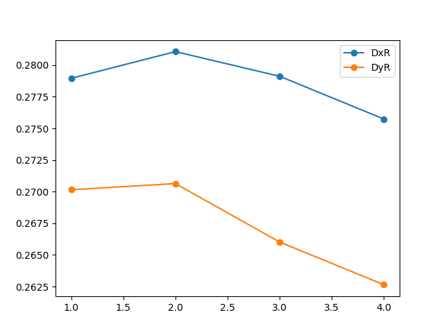

# 实验结果解释
## 符号及其定义
我们定义如下的表达式：
$$
\bar{I} = \sum_W I(x,y)/n\\
\eta =   \sum_W I(x,y)/\sum I(x,y)\\
\sigma = \sqrt{\sum_W\left[\frac{I(x,y)-\bar{I}}{\bar{I}}\right]^2/n}\\
D_x\_\text{relative} = \sqrt{\frac{\sum I(x,y)(x-\bar{x})^2}{\sum I(x,y)}}/\text{columns number} \\
D_y\_\text{relative} = \sqrt{\frac{\sum I(x,y)(y-\bar{y})^2}{\sum I(x,y)}}/\text{rows number} 
$$

## 加入DOE前后CCD图像对比

上述图像都是CCD采集的图像，我们将他们读入为灰度矩阵，灰度值为0-255，矩阵的规模为 240*320. 同时经过反复的尝试，我们将加入DOE后的矩阵中(75, 75, 165, 135)范围内的值认为是整形后的我们需要的部分。亦即上述表达式中的W区域。

直观看：加入DOE前，光斑聚集在一个小的圆形区域内，周围比较黑。加入CCD后主要亮光的区域变成了一个矩形的区域，但周围也出现了杂散光。图像的锐度不如加入DOE前图像的锐度。
我们测量的如下的数据：$\eta_1,\eta_2,\sigma, D_x, D_y,\text{relative }D_x, \text{relative }D_y$, 其中，$\eta_2$与之前的定义相同，$\eta_1$的定义为：
$$
\eta_1 = \sum I(x,y)_{after}/\sum I(x,y)_{before}
$$

结果如下：
1. eta1 = 3.034724
2. eta2 = 0.189703
3. sigma= 0.081490 
4. Dx = 24.957665 像素
5. Dy = 16.208551 像素
6. relative Dx = 0.277307 
7. relative Dy = 0.270143 

其中，eta1大于1的原因是在加入DOE前的图像明显过曝，CCD在记录中超过255的光强统一记为255，而且加入前，光是集中在一个小区域中共，因此图像中的总光强其实小于加入DOE后的总光强。

eta2 就是最开始定义的部分，可以看到，整形区域内只有整个光场的18%的光，因此大量的光散落在空间中。事实上，我们只收集了CCD可收集范围的光，实际的效率要远低于18%。

sigma 按照定义，实际上是反映了整形区域内部的平整度。数值上看，各点距离平均值并不远，因此比较凭证。

Dx和Dy表达的是光斑的尺度。是因为$D4\sigma$ 的值太大了，因此除以了4，考虑到我们是矩形光斑，因此准备了两个方向。它也可以表达整形区域内的平整度。当它趋于无穷是，平面是绝对平整的。为了让它有意义，我们计算了相对Dx和相对Dy，是用上述的值除以光斑的长和宽。可见，相对Dx和相对Dy都比较小，都在27%附件。因此，可以认为这个长方形光斑内部并不均匀，会有方差为27%尺寸附近的突出部分。

为了更形象的表达灰度矩阵，我们做出了3D试图，看加入DOE后的部分：

## 移动DOE距离图像分析

我们将DOE按照等间距，在稳定点前后共8个点观察形成的图像。从图像上看，更多的光从整形区域内溢出成为杂散光。同时，矩形的形状也保持不好。我们将计算如下的量：relative I 为移动后整形区域内的总光强比上移动前。以及Dx和Dy，这里的Dx不再是整形区域内，而是整个CCD收集的光场。结果如下：

由图可见，整形区域内的光强随着距离偏移稳定点迅速下降。

这张图更加明显的表达出，整个CCD光场内光迅速从一个集中的位置平均开来。

## 倾斜DOE图像分析
我们等角度的倾斜DOE，并记录出产生的图像。从图像中看，矩形内部逐渐产生亮斑。这意味着矩形内不再平整。因此，我们也计算了能表示平整度的sigma和Dx，Dy，结果如下：

由上可见，sigma 随着偏转逐渐变小，但是Dx和Dy也再逐渐的变小。这说明，一方面区域内整体来看的确是有更为平整，但是出现了光强更为集中的小区域，表现为D的下降。与图像表达的一致。

## DOE偏轴后图像分析
其实，从图像上看，不能明显的看出偏轴后的图像的区别但是我们可以通过技术指标去看。同上，我们依然从D和sigma两个技术指标来看。结果如下：

从趋势上看，sigma随着离轴的程度逐渐变大。但是第二次可能是因为偶然原因突然变小。逐渐增大的趋势表面矩形内部不再平整。但是从Dx和Dy来看，它们的变换不大，说明并没有出现明显的再矩形内部光强更为集中的现象。

## 偏转衰减片后图像分析
我们考虑了两个指标，分别是sigma和区域内总光强。结果如下：

可以看到，偏转衰减片后，似乎整形区域内变得更加的平整，但是，它的光强呈现出一种周期性变化的趋势。
